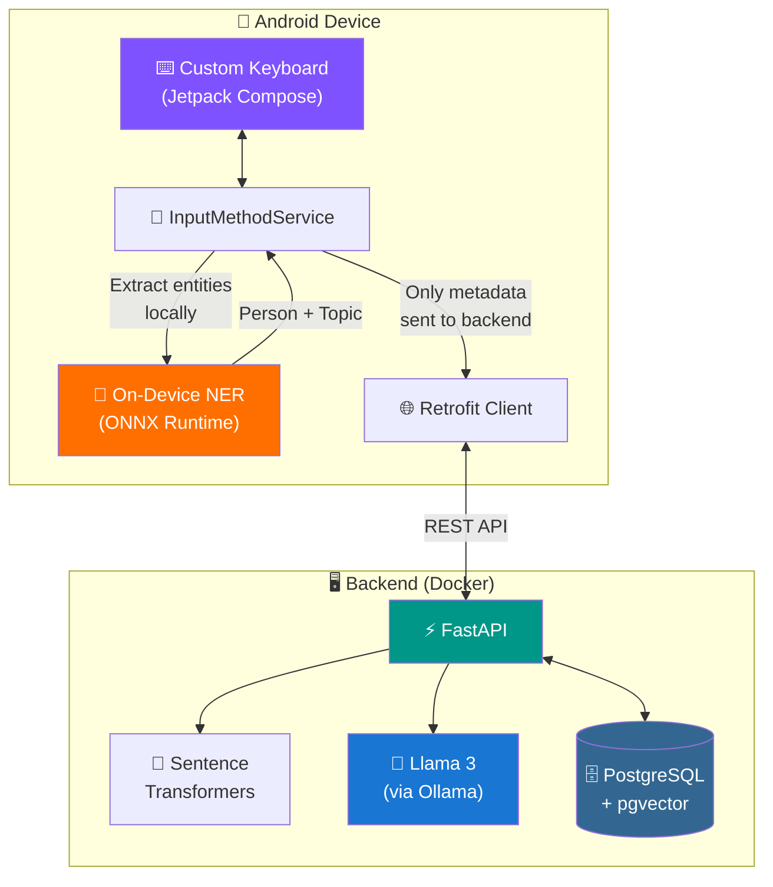

<div align="center">

# 🧠 AI Memory Keyboard

### *Your conversations. Your context. Your memory.*

[](https://kotlinlang.org/)
[](https://developer.android.com/jetpack/compose)
[](https://fastapi.tiangolo.com/)
[](https://ollama.com/)
[](https://github.com/pgvector/pgvector)
[](https://www.docker.com/)

<br/>

> **An Android keyboard that *remembers*.** <br/>
> It learns context about the people you talk to, saves relationship memories, <br/>
> and whispers back AI-powered hints — all while keeping your data 100% local.

<br/>

---

</div>

## 💡 The Problem

You're texting Sam. You *know* he mentioned a job interview last week. Or was it a dentist appointment? You can't remember. You scroll up through 200 messages looking for context.

**What if your keyboard just *told* you?**

## ✨ The Solution

AI Memory Keyboard is a custom Android keyboard that sits between you and every conversation. It:

- 🔍 **Detects** who you're talking about using on-device AI (no data leaves your phone)
- 💾 **Saves** relationship memories with a single tap
- 🧠 **Recalls** relevant context using semantic vector search
- 💬 **Whispers** AI-generated hints powered by a local Llama 3 model

**Example:**

```
You open a chat with "Sam"

┌──────────────────────────────────────────────┐
│  🧠 Last time Sam mentioned a job interview  │
│  at Google. He was nervous about the system   │
│  design round.                         [SAVE] │
├──────────────────────────────────────────────┤
│  Q  W  E  R  T  Y  U  I  O  P               │
│   A  S  D  F  G  H  J  K  L                 │
│     Z  X  C  V  B  N  M                     │
│  [DEL]     [  SPACE  ]        [ENTER]        │
└──────────────────────────────────────────────┘
```

---

## 🏗️ Architecture



---

## 🔒 Privacy by Design

This isn't just a feature — it's the **core philosophy**.

| Layer | What Happens | What's Sent |
|-------|-------------|-------------|
| ⌨️ Keystroke Capture | Buffered locally in `InputMethodService` | ❌ Nothing |
| 🤖 Entity Detection | ONNX model runs **entirely on-device** | ❌ Nothing |
| 📡 Context Hint | Only `person` + `topic` metadata sent | ✅ `{"person": "Sam", "topic": "interview"}` |
| 💾 Save Memory | Only when user **explicitly taps Save** | ✅ User-approved text only |

> **Your raw keystrokes never leave your phone. Ever.**

---

## 📁 Project Structure

```
ai-keyboard/
│
├── 🐳 docker-compose.yml          # One-command backend deployment
├── 📖 README.md
│
├── 🐍 backend/
│   ├── Dockerfile
│   ├── requirements.txt
│   └── app/
│       ├── main.py                 # FastAPI endpoints
│       ├── models.py               # SQLAlchemy ORM models
│       ├── schemas.py              # Pydantic request/response schemas
│       ├── database.py             # PostgreSQL + pgvector connection
│       └── services/
│           ├── embedding_service.py   # all-MiniLM-L6-v2 embeddings
│           └── llm_service.py         # Llama 3 hint generation
│
└── 📱 mobile/
    ├── build.gradle.kts
    ├── settings.gradle.kts
    ├── gradle.properties
    └── app/
        ├── build.gradle.kts
        └── src/main/
            ├── AndroidManifest.xml
            ├── res/
            │   ├── xml/method.xml
            │   └── values/themes.xml
            └── java/com/example/aikeyboard/
                ├── MemoryKeyboardService.kt    # Core keyboard service
                ├── ComposeKeyboardView.kt      # Compose ↔ IME bridge
                ├── ui/KeyboardView.kt          # Compose keyboard UI
                ├── ml/NERExtractor.kt          # On-device ONNX NER
                └── api/BackendClient.kt        # Retrofit API client
```

---

## 🚀 Getting Started

### Prerequisites

| Tool | Purpose |
|------|---------|
| [Docker Desktop](https://docker.com) | Backend infrastructure |
| [Ollama](https://ollama.com) | Local Llama 3 model host |
| [Android Studio](https://developer.android.com/studio) | Mobile development (Ladybug+) |
| Android device or emulator | API 26+ (Android 8.0+) |

### 1️⃣ Start the AI Backend

```bash
# Pull and start the local LLM
ollama pull llama3:latest
ollama serve

# In another terminal, spin up the backend
cd "ai keyboard"
docker compose up --build
```

> ☕ First run downloads the `all-MiniLM-L6-v2` embedding model (~80MB). Grab a coffee.

Verify the backend is running:
```
🌐 http://localhost:8000/docs    → Swagger UI
🏥 http://localhost:8000/health  → Health check
```

### 2️⃣ Build & Install the Keyboard

```bash
# Open the mobile/ directory in Android Studio
# OR build from CLI:
cd mobile
./gradlew installDebug
```

### 3️⃣ Enable the Keyboard

1. 📱 **Settings** → **System** → **Languages & Input** → **On-screen Keyboard**
2. Toggle **AI Memory Keyboard** → `ON`
3. Open any text field → Tap the keyboard icon → Select **AI Memory Keyboard**

---

## 🔌 API Reference

<details>
<summary><b>POST /memory</b> — Save a relationship memory</summary>

```json
// Request
{
  "device_id": "device_123",
  "contact_name": "Sam",
  "memory_text": "Sam got the job at Google! Starts in March."
}

// Response → 201 Created
{
  "id": 42,
  "user_id": 1,
  "contact_id": 7,
  "memory_text": "Sam got the job at Google! Starts in March.",
  "embedding": [0.023, -0.041, ...],
  "created_at": "2025-03-17T18:30:00Z"
}
```
</details>

<details>
<summary><b>POST /suggestions</b> — Get AI context hints</summary>

```json
// Request
{
  "device_id": "device_123",
  "contact_name": "Sam",
  "current_topic": "work"
}

// Response → 200 OK
{
  "hint": "Sam recently got a job at Google and starts in March!",
  "relevant_memories": [
    "Sam got the job at Google! Starts in March.",
    "Sam was preparing for system design interviews."
  ]
}
```
</details>

<details>
<summary><b>GET /memory/person/{name}</b> — Retrieve all memories for a person</summary>

```json
// GET /memory/person/Sam?device_id=device_123
// Response → 200 OK
[
  {
    "id": 42,
    "memory_text": "Sam got the job at Google!",
    "created_at": "2025-03-17T18:30:00Z"
  },
  {
    "id": 38,
    "memory_text": "Sam was nervous about system design interviews.",
    "created_at": "2025-03-15T10:00:00Z"
  }
]
```
</details>

---

## 🛠️ Tech Stack

| Component | Technology | Why |
|-----------|-----------|-----|
| **Keyboard UI** | Jetpack Compose | Modern, declarative Android UI |
| **Keyboard Service** | `InputMethodService` | Native Android IME framework |
| **On-Device NER** | ONNX Runtime Mobile | Fast, private entity extraction |
| **API Client** | Retrofit + Gson | Type-safe HTTP for Android |
| **Backend** | FastAPI (Python) | Async, high-performance API |
| **Vector Search** | PostgreSQL + pgvector | Semantic memory retrieval |
| **Embeddings** | all-MiniLM-L6-v2 | Lightweight 384-dim sentence vectors |
| **LLM** | Llama 3 via Ollama | Fully local, privacy-preserving AI |
| **Infrastructure** | Docker Compose | One-command deployment |

---

## 🗺️ Roadmap

- [ ] 🎨 Dark mode keyboard theme
- [ ] 📊 Memory analytics dashboard
- [ ] 🔤 Swipe-to-type support
- [ ] 🌍 Multi-language NER models
- [ ] 📲 iOS keyboard extension
- [ ] 🔐 End-to-end encryption for memories
- [ ] 🎯 Smart auto-complete powered by context

---

<div align="center">

### Built with ❤️ by [Jayant Vig](https://github.com/Jayyy560)

**If this project helped you, consider giving it a ⭐**

</div>
